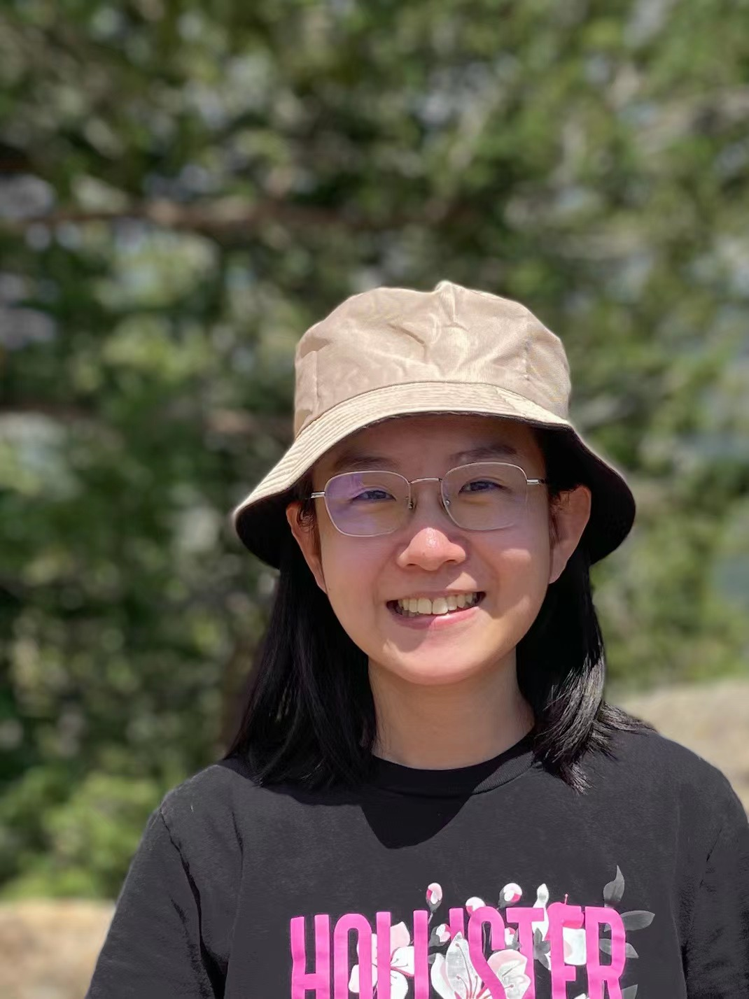

** Yutong Xie  &nbsp;  谢雨桐 **

 
I am a Ph.D. student in the <a href="https://www.si.umich.edu">School of Information</a> at the <a href="https://umich.edu/">University of Michigan</a>. I currently work with <a href="http://www-personal.umich.edu/~qmei/">Prof. Qiaozhu Mei</a> as a member of the <a href="http://foreseer.si.umich.edu/">Foreseer Research Group</a>. 
Prior to this, I received my Bachelor's degree from <a href="https://www.sjtu.edu.cn/">Shanghai Jiao Tong University</a> as a member of the <a href="https://acm.sjtu.edu.cn/home">ACM Honors Class</a>, where I was advised by <a href="http://apex.sjtu.edu.cn/members/yyu">Prof. Yong Yu</a> and <a href="http://wnzhang.net">Prof. Weinan Zhang</a>.

 
I am enthusiastic about exploring the potential of <em>AI for science</em> and <em>AI for creativity</em>. My focus is on using AI to tackle complex computational tasks in scientific research and creative endeavors, which can often be framed as machine learning problems such as prediction, optimization, and generation. I am also interested in examining how AI would collaborate with domain experts such as scientists and artists, and how we can promote such collaborations.

> <i class="fas fa-file-pdf"></i> &nbsp; For more information, please check my [curriculum vitae](https://drive.google.com/file/d/1-1FkJIQoSJNePm4s2RE17UF4TsQAJxAu/view?usp=sharing). \\
> <i class="fas fa-at"></i> &nbsp; yutxie AT umich DOT edu, 
yutongxie98 AT gmail DOT com \\
> <i class="fas fa-link"></i> &nbsp; 
[<i class="fas fa-graduation-cap"></i> Google Scholar](https://scholar.google.com/citations?hl=en&user=ZiKjIeMAAAAJ),
[<i class="fas fa-graduation-cap"></i> Semantic Scholar](https://www.semanticscholar.org/author/Yutong-Xie/3956514),
[<i class="fab fa-github"></i> Github](https://github.com/yutxie),
[<i class="fab fa-twitter"></i> Twitter](https://twitter.com/yutxie),
[<i class="fab fa-linkedin-in"></i> LinkedIn](https://www.linkedin.com/in/yutxie) 

----------------------------

NEW! 
Our paper on [text-to-image prompt analysis]() was accepted by WWW 2023 on the Creative Web Track! \\
NEW! 
Our paper on [chemical space exploration measures](https://openreview.net/forum?id=Yo06F8kfMa1) was accepted by ICLR 2023! 

----------------------------

## Selected Publications

> For the full publication list, please refer to my [Google Scholar profile](https://scholar.google.com/citations?hl=en&user=ZiKjIeMAAAAJ&view_op=list_works&sortby=pubdate). 

[**A Prompt Log Analysis of Text-to-Image Generation Systems**]() [<i class="fas fa-file-pdf"></i>]() \\
**Yutong Xie**\*, Zhaoying Pan\*, Jinge Ma\*, Jie Luo, Qiaozhu Mei. \\
The ACM Web Conference (WWW), 2023 (The Creative Web Track). 

[**How Much Space Has Been Explored? Measuring the Chemical Space Covered by Databases and Machine-Generated Molecules**](https://openreview.net/forum?id=Yo06F8kfMa1) [<i class="fas fa-file-pdf"></i>](https://openreview.net/pdf?id=Yo06F8kfMa1) \\
**Yutong Xie**, Ziqiao Xu, Jiaqi Ma, Qiaozhu Mei. \\
International Conference on Learning Representations (ICLR), 2023. \\
<!-- (Also appered on the International Conference on Machine Learning (ICML) AI for Science Workshop, 2022. ) \\ -->
[[Code](https://github.com/yutxie/exploration-measures)\] [[SlidesLive](https://icml.cc/virtual/2022/workshop/13450#wse-detail-19911)\] [[Slides](https://drive.google.com/file/d/1w-MSFSwq4ho3cNCL-_jsId5K6N5IZDZ7/view?usp=sharing)\] [[Poster](https://drive.google.com/file/d/1wEpjtZkaim2NHozEdB65AfamWXXW02aI/view?usp=sharing)\]

[**Multi-View Graph Representation for Programming Language Processing: An Investigation into Algorithm Detection**](https://ojs.aaai.org/index.php/AAAI/article/view/20522) [<i class="fas fa-file-pdf"></i>](https://ojs.aaai.org/index.php/AAAI/article/view/20522/20281)\\
Ting Long\*, **Yutong Xie**\*, Xianyu Chen, Weinan Zhang, Qinxiang Cao, Yong Yu.\\
AAAI Conference on Artificial Intelligence (AAAI), 2022 (acceptance rate 15%). \\
[[Code](https://github.com/githubg0/mvg)\] [[Slides](https://drive.google.com/file/d/1vOYiwoyWEQ1K1aAH-6muqYIcyUiRGGlt/view?usp=sharing)\] [[Poster](https://drive.google.com/file/d/1hmtwlBr709esYcXHez99t09GkF55_WA0/view?usp=sharing)\]

[**MARS: Markov Molecular Sampling for Multi-objective Drug Discovery**](https://openreview.net/forum?id=kHSu4ebxFXY) [<i class="fas fa-file-pdf"></i>](https://openreview.net/pdf?id=kHSu4ebxFXY)\\
**Yutong Xie**, Chence Shi, Hao Zhou, Yuwei Yang, Weinan Zhang, Yong Yu, Lei Li.\\
International Conference on Learning Representations (ICLR), 2021.\\
<a href="https://iclr.cc/virtual/2021/spotlight/3417" style="color:red">**Spotlight presentation (top 5%).** <i class="fas fa-video"></i> </a>\\
[[Code](https://github.com/yutxie/MARS)\] [[SlidesLive](https://iclr.cc/virtual/2021/spotlight/3417)\] [[Slides](https://drive.google.com/file/d/1vbdP1CjAuYj4eB9GX2-3uqmfgSqISIxD/view?usp=sharing)\] [[Poster](https://drive.google.com/file/d/1iCLBQ0RacNZhg0bUIVYaKfPemmWK7Jqc/view?usp=sharing)\] [[AI Time](https://www.bilibili.com/video/BV1Eo4y1172a)\] [[WeChat Article](https://mp.weixin.qq.com/s/RfxKVF9nuG0_DkorTeWxJQ)\]

<!-- [**Visual Rhythm Prediction with Feature-Aligned Network**](https://ieeexplore.ieee.org/abstract/document/8757943) [<i class="fas fa-file-pdf"></i>](http://www.mva-org.jp/Proceedings/2019/papers/05-20.pdf)\\
**Yutong Xie**, Haiyang Wang, Zihao Xu, Yan Hao.\\
IAPR International Conference on Machine Vision Applications Conference (MVA), 2019. -->

\* = equal contribution
