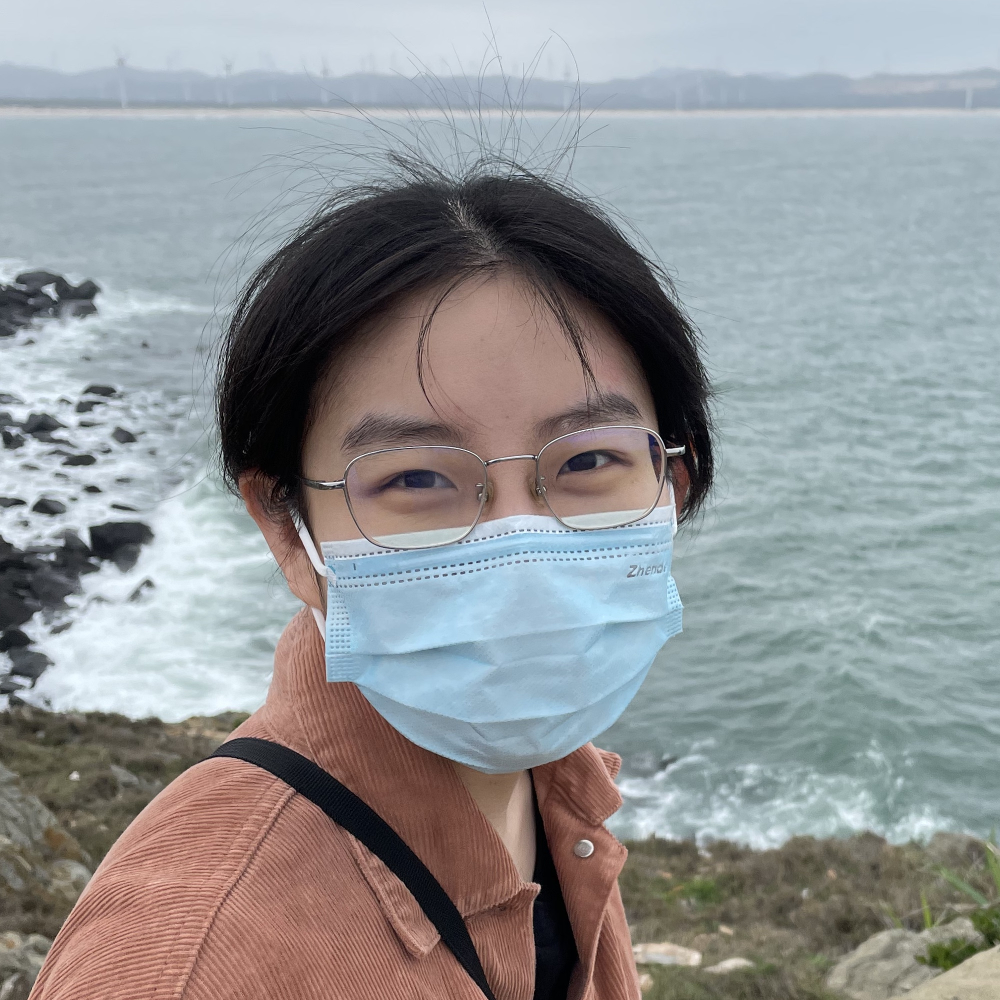

** Yutong Xie  &nbsp;  谢雨桐 **

I am a Ph.D. student in the [School of Information](https://www.si.umich.edu) at the [University of Michigan](https://umich.edu/). I work with [Prof. Qiaozhu Mei](http://www-personal.umich.edu/~qmei/) in the [Foreseer Group](http://foreseer.si.umich.edu/). Prior to this, I received my Bachelor's degree from [Shanghai Jiao Tong University](https://www.sjtu.edu.cn) as a member of the [ACM Honors Class](https://acm.sjtu.edu.cn/home), advised by [Prof. Yong Yu](http://apex.sjtu.edu.cn/members/yyu) and [Prof. Weinan Zhang](http://wnzhang.net).

My research interests lie in machine learning methods for representing, measuring, and generating objects, including graph learning, natural language processing, _etc_. I'm also excited about employing AI techniques to solve natural and social science problems, like drug discovery. 

<i class="fas fa-at"></i> &nbsp; yutxie AT umich DOT edu, yutongxie98 AT gmail DOT com \\
<i class="fas fa-link"></i> &nbsp; [<i class="fas fa-graduation-cap"></i> Google Scholar](https://scholar.google.com/citations?hl=en&user=ZiKjIeMAAAAJ) [<i class="fas fa-graduation-cap"></i> Semantic Scholar](https://www.semanticscholar.org/author/Yutong-Xie/3956514) [<i class="fab fa-github"></i> Github](https://github.com/yutxie) [<i class="fab fa-twitter"></i> Twitter](https://twitter.com/yutxie) [<i class="fab fa-linkedin-in"></i> LinkedIn](https://www.linkedin.com/in/yutxie) [<i class="fas fa-file-pdf"></i> CV](https://drive.google.com/file/d/1h9fF7i_p7Q4kj00bNGRBiG36f4OMVtUz/view?usp=sharing)

----------------------------

**NEW!** Our paper on [chemical space exploration measures](https://openreview.net/forum?id=BIBc6KCCwRX) was accepted by the ICML 2022 AI4Science Workshop!\
**NEW!** Our paper on [program representation (MVG)](https://arxiv.org/abs/2202.12481) was accepted by AAAI 2022!\
**NEW!** Our paper on [multi-objective drug discovery (MARS)](https://openreview.net/pdf?id=kHSu4ebxFXY) was accepted by ICLR 2021 with a [**spotlight presentation**](https://iclr.cc/virtual/2021/spotlight/3417)!

----------------------------

## Publications

[**How Much of the Chemical Space Has Been Explored? Selecting the Right Exploration Measure for Drug Discovery**](https://openreview.net/forum?id=BIBc6KCCwRX) [<i class="fas fa-file-pdf"></i>](https://openreview.net/pdf?id=BIBc6KCCwRX) \\
**Yutong Xie**, Ziqiao Xu, Jiaqi Ma, Qiaozhu Mei. \\
International Conference on Machine Learning (ICML) AI for Science Workshop, 2022. \\
[[Code]()\] [[SlidesLive]()\] [[Poster]()\] 

[**Multi-View Graph Representation for Programming Language Processing: An Investigation into Algorithm Detection**](https://arxiv.org/abs/2202.12481) [<i class="fas fa-file-pdf"></i>](https://www.aaai.org/AAAI22Papers/AAAI-928.LongT.pdf)\\
Ting Long\*, **Yutong Xie**\*, Xianyu Chen, Weinan Zhang, Qinxiang Cao, Yong Yu.\\
AAAI Conference on Artificial Intelligence (AAAI), 2022 (acceptance rate 15%). \\
[[Code](https://github.com/githubg0/mvg)\] [[Poster](https://drive.google.com/file/d/1hmtwlBr709esYcXHez99t09GkF55_WA0/view?usp=sharing)\]

[**MARS: Markov Molecular Sampling for Multi-objective Drug Discovery**](https://openreview.net/forum?id=kHSu4ebxFXY) [<i class="fas fa-file-pdf"></i>](https://openreview.net/pdf?id=kHSu4ebxFXY)\\
**Yutong Xie**, Chence Shi, Hao Zhou, Yuwei Yang, Weinan Zhang, Yong Yu, Lei Li.\\
International Conference on Learning Representations (ICLR), 2021.\\
<a href="https://iclr.cc/virtual/2021/spotlight/3417" style="color:red">**Spotlight presentation (top 5%).** <i class="fas fa-video"></i> </a>\\
[[Code](https://github.com/yutxie/MARS)\] [[SlidesLive](https://iclr.cc/virtual/2021/spotlight/3417)\] [[Poster](https://drive.google.com/file/d/1iCLBQ0RacNZhg0bUIVYaKfPemmWK7Jqc/view?usp=sharing)\] [[AI Time](https://www.bilibili.com/video/BV1Eo4y1172a)\] [[WeChat Article](https://mp.weixin.qq.com/s/RfxKVF9nuG0_DkorTeWxJQ)\]

[**Visual Rhythm Prediction with Feature-Aligned Network**](https://ieeexplore.ieee.org/abstract/document/8757943) [<i class="fas fa-file-pdf"></i>](http://www.mva-org.jp/Proceedings/2019/papers/05-20.pdf)\\
**Yutong Xie**, Haiyang Wang, Zihao Xu, Yan Hao.\\
IAPR International Conference on Machine Vision Applications Conference (MVA), 2019.

(\* = equal contribution)

