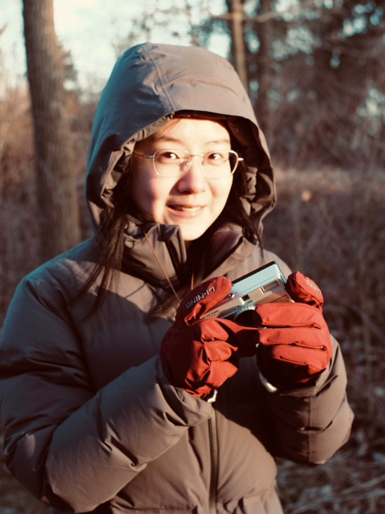

** Yutong Xie  &nbsp;  谢雨桐 **

 
I am a Ph.D. candidate in the <a href="https://www.si.umich.edu">School of Information</a> at the <a href="https://umich.edu/">University of Michigan</a>, where I work with <a href="http://www-personal.umich.edu/~qmei/">Prof. Qiaozhu Mei</a> as a member of the <a href="http://foreseer.si.umich.edu/">Foreseer Research Group</a>. 
Prior to this, I received my Bachelor's degree from <a href="https://www.sjtu.edu.cn/">Shanghai Jiao Tong University</a> as a member of the <a href="https://acm.sjtu.edu.cn/home">ACM Honors Class</a>, where I was advised by <a href="http://apex.sjtu.edu.cn/members/yyu">Prof. Yong Yu</a> and <a href="http://wnzhang.net">Prof. Weinan Zhang</a>.

 
I have a general research interest in exploring the potential of AI to support and drive innovation, with a specific focus on both scientific innovation (<em>AI for science</em>) [<a href="https://openreview.net/forum?id=kHSu4ebxFXY">ICLR'21</a>, <a href="https://openreview.net/forum?id=Yo06F8kfMa1">ICLR'23</a>] and creative endeavors (<em>AI for creativity</em>) [<a href="https://dl.acm.org/doi/abs/10.1145/3543507.3587430">WWW'23</a>]. My research encompasses three key aspects: 
<ol>
<li> Identifying the innovation space ("What to innovate") [<a href="https://dl.acm.org/doi/abs/10.1145/3543507.3587430">WWW'23</a>]; </li>
<li> Devising computational methodologies for innovative solutions ("How to innovate") [<a href="https://openreview.net/forum?id=kHSu4ebxFXY">ICLR'21</a>]; and </li>
<li> Establishing robust criteria for evaluating these innovations ("How to evaluate") [<a href="https://openreview.net/forum?id=Yo06F8kfMa1">ICLR'23</a>]. </li>
</ol>

A significant part of my work involves examining the synergistic relationship between AI and humans under the context of innovation as well as broader scenarios. Particularly, I am interested in the problems of how to understand, align, and direct the behaviors of powerful AI such as large language models (<em>AI behavioral science</em>) [<a href="https://www.pnas.org/doi/10.1073/pnas.2313925121">PNAS'24</a>], which is crucial for fostering better human-AI collaborations.

> <i class="fas fa-file-pdf"></i> &nbsp; For more information, please check my [curriculum vitae](https://drive.google.com/file/d/1-1FkJIQoSJNePm4s2RE17UF4TsQAJxAu/view?usp=sharing). \\
> <i class="fas fa-at"></i> &nbsp; yutxie AT umich DOT edu, 
yutongxie98 AT gmail DOT com \\
> <i class="fas fa-link"></i> &nbsp; 
[<i class="fas fa-graduation-cap"></i> Google Scholar](https://scholar.google.com/citations?hl=en&user=ZiKjIeMAAAAJ),
[<i class="fas fa-graduation-cap"></i> Semantic Scholar](https://www.semanticscholar.org/author/Yutong-Xie/3956514),
[<i class="fab fa-github"></i> Github](https://github.com/yutxie),
[<i class="fab fa-twitter"></i> Twitter](https://twitter.com/yutxie),
[<i class="fab fa-linkedin-in"></i> LinkedIn](https://www.linkedin.com/in/yutxie) 

----------------------------

NEW! 
Our paper on [a behavirol Turing test of ChatGPT](https://www.pnas.org/doi/10.1073/pnas.2313925121) was published at PNAS! \\
NEW! 
We made a video that shows [the evolution of AI and data mining over half a century](https://www.youtube.com/watch?v=J0nB0uRRCo4)! \\
NEW! 
Our paper on [text-to-image prompt analysis](https://dl.acm.org/doi/abs/10.1145/3543507.3587430) was accepted by WWW 2023 in the Creative Web Track! \\
NEW! 
Our paper on [chemical space coverage measures](https://openreview.net/forum?id=Yo06F8kfMa1) was accepted by ICLR 2023! 

----------------------------

## Selected Publications

> For the full publication list, please refer to my [Google Scholar profile](https://scholar.google.com/citations?hl=en&user=ZiKjIeMAAAAJ&view_op=list_works&sortby=pubdate). 

[**A Turing test of whether AI chatbots are behaviorally similar to humans**](https://www.pnas.org/doi/10.1073/pnas.2313925121) \\
Qiaozhu Mei, **Yutong Xie**, Walter Yuan, Matthew O. Jackson. \\
Proceedings of the National Academy of Sciences of the United States of America (PNAS), Feb 2024.  \\
[[arXiv](https://arxiv.org/abs/2312.00798)\]
[[SSRN](https://papers.ssrn.com/sol3/papers.cfm?abstract_id=4637354)\]
[[Code](https://github.com/yutxie/ChatGPT-Behavioral)\] 
[[UMich News](https://news.umich.edu/chatgpt-acts-more-altruistically-cooperatively-than-humans/)\] 
[[Stanford News](https://humsci.stanford.edu/feature/study-finds-chatgpts-latest-bot-behaves-humans-only-better)\] 

[**A Prompt Log Analysis of Text-to-Image Generation Systems**](https://dl.acm.org/doi/abs/10.1145/3543507.3587430) \\
**Yutong Xie**\*, Zhaoying Pan\*, Jinge Ma\*, Luo Jie, Qiaozhu Mei. \\
The ACM Web Conference (WWW), 2023 (The Creative Web Track). \\
[[PDF](https://dl.acm.org/doi/pdf/10.1145/3543507.3587430)\]
[[arXiv](https://arxiv.org/pdf/2303.04587.pdf)\]
[[Code](https://github.com/zhaoyingpan/prompt_log_analysis)\] 
[[Video](https://youtu.be/D-N1_lwhNnk)\]
<!-- [[SlidesLive]()\]  -->
[[Slides](https://drive.google.com/file/d/1L0D7I0vdcfCSAQ9oB476i9N6mN6rC3ad/view?usp=sharing)\] 
<!-- [[Poster]()\] -->

[**How Much Space Has Been Explored? Measuring the Chemical Space Covered by Databases and Machine-Generated Molecules**](https://openreview.net/forum?id=Yo06F8kfMa1) \\
**Yutong Xie**, Ziqiao Xu, Jiaqi Ma, Qiaozhu Mei. \\
International Conference on Learning Representations (ICLR), 2023. \\
International Conference on Machine Learning (ICML) AI for Science Workshop, 2022. \\
[[PDF](https://openreview.net/pdf?id=Yo06F8kfMa1)\]
[[Code](https://github.com/yutxie/exploration-measures)\] 
[[SlidesLive](https://iclr.cc/virtual/2023/poster/11769)\] 
[[Slides](https://drive.google.com/file/d/15Jfl64W7-E_lb5-ecT8n5Qehv4mxEn3A/view?usp=sharing)\] 
[[Poster](https://iclr.cc/media/PosterPDFs/ICLR%202023/11769.png?t=1682437570.514978)\]
[[AI Time Talk](https://www.bilibili.com/video/BV12X4y1f7P7/?share_source=copy_web&vd_source=cc7b830a98543ee4bb061e90ba3cc4fd&t=1533)\] 

[**Multi-View Graph Representation for Programming Language Processing: An Investigation into Algorithm Detection**](https://ojs.aaai.org/index.php/AAAI/article/view/20522) \\
Ting Long\*, **Yutong Xie**\*, Xianyu Chen, Weinan Zhang, Qinxiang Cao, Yong Yu.\\
AAAI Conference on Artificial Intelligence (AAAI), 2022 (acceptance rate 15%). \\
[[PDF](https://ojs.aaai.org/index.php/AAAI/article/view/20522/20281)\]
[[Code](https://github.com/githubg0/mvg)\] 
[[SlidesLive](https://aaai-2022.virtualchair.net/poster_aaai928)\] 
[[Slides](https://drive.google.com/file/d/1vOYiwoyWEQ1K1aAH-6muqYIcyUiRGGlt/view?usp=sharing)\] 
[[Poster](https://drive.google.com/file/d/1hmtwlBr709esYcXHez99t09GkF55_WA0/view?usp=sharing)\]

[**MARS: Markov Molecular Sampling for Multi-objective Drug Discovery**](https://openreview.net/forum?id=kHSu4ebxFXY) \\
**Yutong Xie**, Chence Shi, Hao Zhou, Yuwei Yang, Weinan Zhang, Yong Yu, Lei Li.\\
International Conference on Learning Representations (ICLR), 2021.\\
<a href="https://iclr.cc/virtual/2021/spotlight/3417" style="color:red">**Spotlight presentation (top 5%).** <i class="fas fa-video"></i> </a>\\
[[PDF](https://openreview.net/pdf?id=kHSu4ebxFXY)\]
[[Code](https://github.com/yutxie/MARS)\] 
[[SlidesLive](https://iclr.cc/virtual/2021/spotlight/3417)\] 
[[Slides](https://drive.google.com/file/d/1vbdP1CjAuYj4eB9GX2-3uqmfgSqISIxD/view?usp=sharing)\] 
[[Poster](https://drive.google.com/file/d/1iCLBQ0RacNZhg0bUIVYaKfPemmWK7Jqc/view?usp=sharing)\] 
[[AI Time Talk](https://www.bilibili.com/video/BV1Eo4y1172a)\] 
[[WeChat Article](https://mp.weixin.qq.com/s/RfxKVF9nuG0_DkorTeWxJQ)\]

<!-- [**Visual Rhythm Prediction with Feature-Aligned Network**](https://ieeexplore.ieee.org/abstract/document/8757943) \\
**Yutong Xie**, Haiyang Wang, Zihao Xu, Yan Hao.\\
IAPR International Conference on Machine Vision Applications Conference (MVA), 2019.\\
[[PDF](http://www.mva-org.jp/Proceedings/2019/papers/05-20.pdf)\] -->
<!-- [[Code](https://github.com/shsjxzh/Visual-Rhythm-Prediction-with-Feature-Aligning-Network)\] 
[[Video](https://www.youtube.com/watch?v=6n_spVFJQB8)\]  -->

\* = equal contribution
